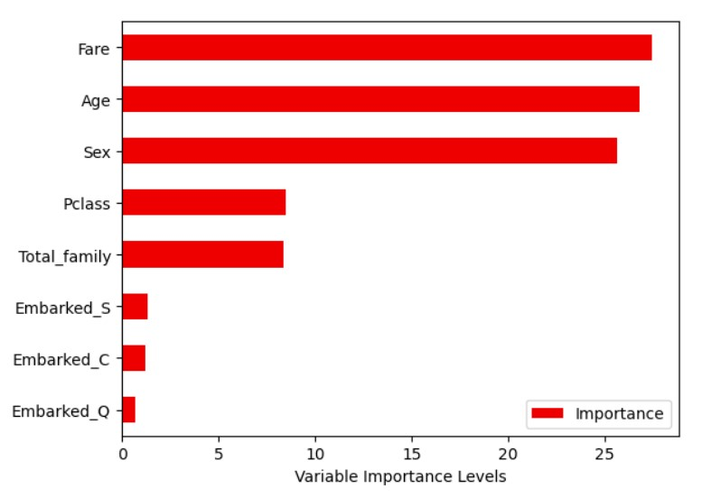

# 🚢 Titanic Survival Prediction 🚢

## 🎯 Description
Bienvenue dans ce projet inspiré du célèbre naufrage du Titanic !   
L'objectif est de prédire si un passager a survécu ou non au drame, en se basant sur des caractéristiques comme l'âge, le sexe, la classe de cabine et d'autres variables.  
Ce projet est une excellente introduction à la science des données et au machine learning grâce au défi Kaggle [Titanic - Machine Learning from Disaster](https://www.kaggle.com/competitions/titanic/overview). 

## 🔍 Analyse et Approche
Voici un aperçu des étapes principales du projet :
1. **Exploration des données**   
   - Analyse descriptive des variables fournies.  
   - Visualisation des données pour mieux comprendre les tendances. 
2. **Préparation des données**  
   - Gestion des valeurs manquantes.  
   - Encodage des variables catégoriques.  
   - Normalisation des données.  
3. **Modélisation**   
   - Application de modèles de classification (Random Forest, Logistic Regression, etc.).  
   - Évaluation des performances avec des métriques comme l'accuracy et le F1-score.  
4. **Optimisation**  
   - Ajustement des hyperparamètres pour améliorer les prédictions.

## 🚣‍♀️ Résultats obtenus

### **Précision des modèles** :
- **Random Forest Classifier** : 85% d'accuracy. 🌟
- **Logistic Regression** : 80% d'accuracy.
- **K-Nearest Neighbors (KNN)** : 78% d'accuracy.

### 🧬 **Matrice de corrélation** :
Une analyse des corrélations montre les relations entre les variables. Voici une matrice de corrélation visuelle :

  

###  📊 **Diagramme variables d'importances** :
Diagramme montrant les variables ayant le plus d'importance pour le modèle Random Forest Classifier :

  

Les variables influant le plus le chance de survie d'un passager (pour le modèle RFC) sont : 
- le prix du billet
- l'âge
- le sexe
Ce qui est cohérent avec la logique de l'époque ("les femmes et les enfants les plus riches d'abord !")

## 🛠️ Technologies et Librairies
- **Langage** : Python 
- **Environnement** : Jupyter Notebook 
- **Librairies** :
  - Manipulation des données : `pandas`, `numpy`
  - Visualisation : `matplotlib`, `seaborn`
  - Modélisation : `scikit-learn`

## 🚀 Lancer le projet
Vous trouverez le notebook Python juste ici : [Noteboobk Python](Titanic_Kaggle.ipynb)  
N'oubliez pas de télécharger [test.csv](test.csv) ainsi que [train.csv](train.csv) (pour l'apprentissage et le test) !

## J'espère que ce projet vous aura plu !
